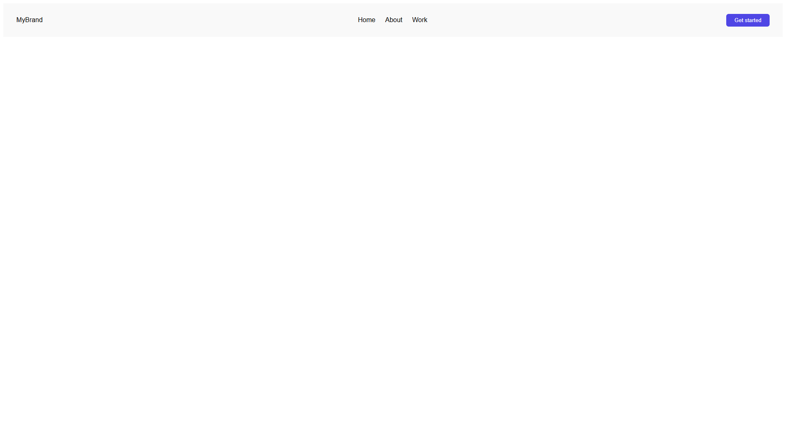
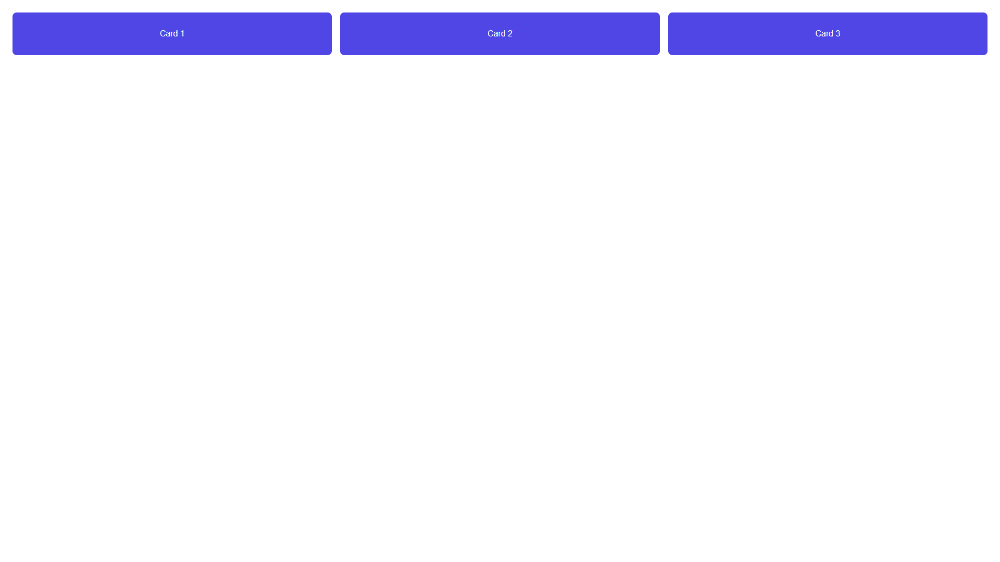
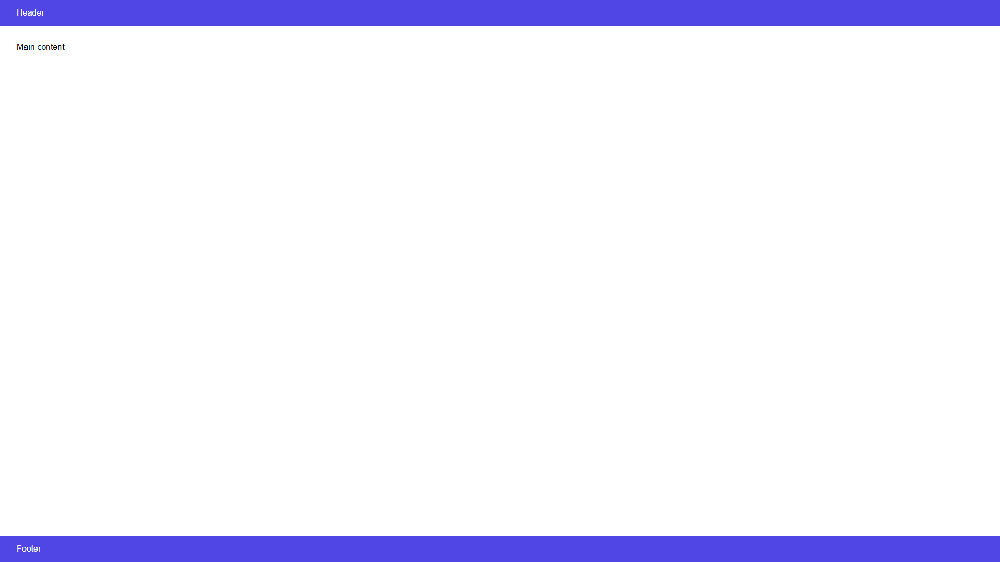
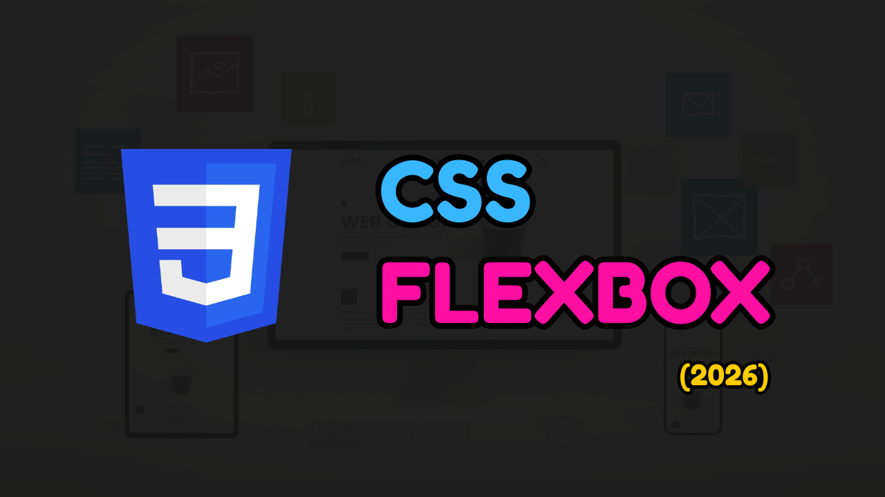

# 🎯 CSS Flexbox

A practical mini-collection of Flexbox layouts built with plain HTML and CSS.
This project focuses on core Flexbox patterns you will use all the time: responsive cards, a horizontal navbar, and a full-height page structure.

## Preview

### Navbar layout



### Cards layout



### Page layout



## What you will practice

- Building flexible card layouts with wrapping and equal growth
- Structuring a navbar with aligned items and spacing
- Creating sticky-style page composition using column direction and full viewport height
- Using common Flexbox properties in real UI examples:
  - `display: flex`
  - `flex-direction`
  - `justify-content`
  - `align-items`
  - `flex-wrap`
  - `gap`
  - `flex: 1`

## Demos included

### 1) Navbar layout

Folder: `navbar/`

- Brand, navigation links, and CTA aligned in one row
- Uses `justify-content: space-between` and `align-items: center`

Run: open `navbar/index.html`

### 2) Cards layout

Folder: `cards/`

- Responsive card row that wraps on smaller widths
- Uses `flex-wrap` + `gap` + `min-width` to keep cards readable

Run: open `cards/index.html`

### 3) Page layout

Folder: `page/`

- Header + main + footer arranged vertically
- Uses `flex-direction: column` and `min-height: 100vh`
- Main content grows with `flex: 1`

Run: open `page/index.html`

## Tech used

- HTML
- CSS

## Project structure

```text
css-flexbox/
├── cards/
│   ├── cards.css
│   └── index.html
├── navbar/
│   ├── index.html
│   └── navbar.css
├── page/
│   ├── index.html
│   └── page.css
├── readme/
│   ├── cards.png
│   ├── navbar.png
│   ├── page.png
│   └── css-flexbox-thumb.png
├── LICENSE
└── README.md
```

## Run locally

This is a static project.

1. Open this folder in VS Code.
2. Open any demo HTML file in your browser:
   - `cards/index.html`
   - `navbar/index.html`
   - `page/index.html`

You can also use Live Server for faster iteration while editing.

## 🎥 Tutorial video

There is also a companion tutorial video for this project, where the layouts are built step by step and the Flexbox behavior is explained along the way.



If you want to see how the pieces fit together, watch it here: [CSS Flexbox tutorial video.](https://www.youtube.com/watch?v=2hmFAnEOkoQ)
